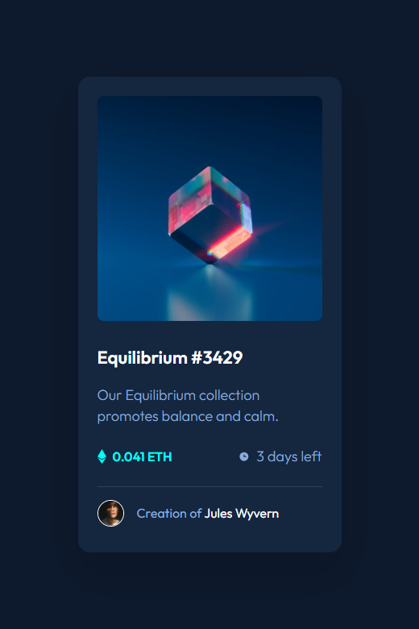

# Frontend Mentor - NFT preview card component solution

This is a solution to the [NFT preview card component challenge on Frontend Mentor](https://www.frontendmentor.io/challenges/nft-preview-card-component-SbdUL_w0U).

## Table of contents

- [Overview](#overview)
  - [The challenge](#the-challenge)
  - [Screenshot](#screenshot)
  - [Links](#links)
- [My process](#my-process)
  - [Built with](#built-with)
- [Author](#author)

## Overview

### The challenge

Your users should be able to:

- View the optimal layout depending on their device's screen size
- See hover states for interactive elements

### Screenshot

### Links

- [Solution URL](https://github.com/ferfalcon/nft-preview-card-component/)
- [Live Site URL](https://ferfalcon.github.io/nft-preview-card-component/)

## Built with

- Semantic HTML5 markup
- CSS custom properties
- CSS Grid
- CSS Flexbox
- Less preprocessor [lesscss.org](https://lesscss.org/)
- Mobile-first workflow

## Author

- Website - [ferfalcon.com](http://ferfalcon.com/)
- Frontend Mentor - [@ferfalcon](https://www.frontendmentor.io/profile/ferfalcon/)
- LinkedIn - [Fernando Falcon](https://www.linkedin.com/in/fernandofalcon/)
- Twitter - [@fernandofalcon](https://www.twitter.com/fernandofalcon/)